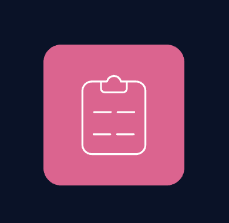

# Product feedback app

### Table of Contents

- [Prerequisites](#Prerequisites)
- [Tech Stack](#Tech-Stack)
- [Getting Started](#Getting-Started)
- [Project Structure](#Project-Structure)
- [Deployment](#Deployment)
- [Resources](#Resources)

#

### Prerequisites

-  Node JS @16.X and up
-  npm @8 and up

#

### Tech Stack

-  React @18.2.0 - front-end framework
-  Tailwind @3.1.8 - CSS framework
-  Tailwind @7.37.0 - flexible and extensible forms with easy-to-use validation.
-  Redux @8.0.4 - A Predictable State Container for JS Apps
-  reduxjs/toolkit @1.8.6 - The official, opinionated, batteries-included toolset for efficient Redux development
-  React-router @6.4.2 - Declarative routing for React apps at any scale
-  React-select @5.4.0 - A flexible and beautiful Select Input control for ReactJS
-  Axios @1.1.2 - Promise based HTTP client for the browser and node.js

#

### Getting Started

1. First of all you need to clone app repository from github:

```
git clone https://github.com/nikanoza/product-feedback-front.git
```

2. Next step requires install all the dependencies.

```
npm install
```

3. To see project in action

```
npm start
```

#

### Project Structure

```
|--- src
|   |--- components # reusable components
|   |---|--- index.ts # export all components
|   |--- hooks # custom helper hooks
|   |--- pages # page components folder
|   |--- services # axios request functions
|   |--- store # redux state management folder
|   |--- svg # svg components folder
- package.json     # dependency manager configurations
```

#

### Deployment

Before every deployment you need to create build file.

```
npm run build
```

after this you can use this file to deploy project on server.

#

### Resources

- [figma](https://www.figma.com/file/fB8LPhi0hrbZVbdt81G5K1/product-feedback-app?t=jmOL7pQMM9lmLKGs-0).
- [challenge](https://www.frontendmentor.io/challenges/product-feedback-app-wbvUYqjR6).
